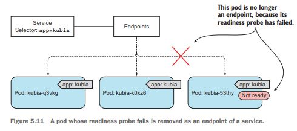

<style>
.section{
font-family: 'D2Coding', serif !important;
}
</style>


# 5장. 서비스

: 클라이언트가 파드를 검색하고 통신을 가능하게 함

---

## 쿠버네티스에서 서비스를 이용하는 이유

1. 파드는 일시적이다.
2. 클라이언트가 서버인 파드의 IP 주소를 미리 알지 못한다.
3. 클라이언트는 굳이 서비스를 지원하는 파드의 수와 IP에 상관하지 않아야 한다.

- 그래서 쿠버네티스의 서비스는 동일한 서비스를 제공하는 파드 그룹에 지속적인 단일 접점을 만들려고할 때 생성하는 리소스이다.

---

## 5.1 서비스 소개

- 쿠버네티스의 서비스는 동일한 서비스를 제공하는 파드 그룹에 지속적인 단일 접점을 만들려고할 때 생성하는 리소스
  - 각 서비스는 서비스가 존재하는 동안 절대 바뀌지 않는 IP 주소와 포트가 있다.
  - Frontend service, Backend service는 절대 바뀌지 않는다.

---

## 5.1 서비스 소개


---

### 5.1.1 서비스 생성

- 정확히 어떤 파드가 서비스의 일부분인지 아닌지를 정의하는 방법은 레이블 셀렉터Label selector를 사용하는 것이다.(뒷장 그림)

```yml
apiVersion: v1
kind: Service
metadata:
  name: kubia
spec:
  ports:
    - port: 80 # 서비스는 이 포트를 사용한다.
      targetPort: 8080 # 서비스가 포워드할 파드의 포트
  selector:
    app: kubia # app: kubia selector를 활용하였다.
```

- 다음 그림에서는 app:kubia라는 selector를 활용하였다.

---

### 5.1.1 서비스 생성


---

### 5.1.1 서비스 생성

- 클러스터 내에서 서비스로 요청을 보내는 방법
    - 서비스의 클러스터 IP로 요청을 보내고 응답을 로그로 찍어놓는 파드 만들기
    - 쿠버네티스 노드로 ssh 접속하고 curl 명령어 실행
    - kubectl exec 명령어로 기존 파드의 컨테이너에서 curl 명령을 실행할 수 있다.
        - kubectl exec : 원격으로 임의의 명령어를 실행 가능

---

### 5.1.1 서비스 생성

```shell
$ kubectl exec kubia-7nog1 -- curl -s http://10.111.249.153
```


---

### 5.1.2 서비스 검색

- 쿠버네티스는 클라이언트 파드가 서비스의 IP와 포트를 검색할 수 있는 방법을 제공한다.
  - 환경변수를 통한 서비스 검색
  - DNS를 통한 서비스 검색
    - 각 서비스는 내부 DNS 서버에서 DNS 항목을 가져오고 서비스 이름을 알고 있는 클라이언트 파드는 환경변수 대신 FQDN으로 접근이 가능하다.
    - 서비스의 이름을 다음과 같이 사용해서 엑세스도 가능하다.

```shell
root@kubia-3inly:/# curl http://kubia.default.svc.cluster.local
```

- 서비스의 클러스터 IP가 가상아이피이므로 서비스 포트와 결합된 경우에만 의미가 있다.

---

## 5.2 클러스터 외부에 있는 서비스 연결

- 서비스가 클러스터 내에 있는 파드로 연결을 전달하는 게 아니라, 외부 IP와 포트로 연결을 전달한다.

---

### 5.2.1 서비스 엔드포인트 소개

- 다음과 같이 입력하면 서비스의 엔드포인트 파드들의 ip와 port를 알 수 있다.
- 파드 셀렉터를 가지고 서비스를 만들면 엔드포인트 리소스를 알 수 있다.

```shell
$ kubectl describe svc kubia
```

```shell
$ kubectl get endpoints kubia
```

---

### 5.2.2 서비스 엔드포인트 수동 구성

- 수동으로 관리되는 엔드포인트를 사용해서 서비스를 만들려면 서비스와 엔드포인트 리소스를 모두 만들어야 한다.(**서비스 구성**)

```yml
apiVersion: v1
kind: Service
metadata:
  # 서비스 이름은 엔드포인트 오브젝트와 같아야 한다.
  name: external-service
  # 이 서비스에는 셀렉터가 정의되어 있지 않다.
spec:
  ports:
    - port: 80
```

---

### 5.2.2 서비스 엔드포인트 수동 구성

- 수동으로 관리되는 엔드포인트를 사용해서 서비스를 만들려면 서비스와 엔드포인트 리소스를 모두 만들어야 한다.(**엔드포인트 구성**)

```yml
apiVersion: v1
kind: Endpoints
metadata:
  # 엔드포인트 오브젝트 이름은 서비스 이름과 일치해야 한다
  name: external-service
subsets:
  - addresses:
      # ip와 port를 수동으로 설정했다.
      - ip: 11.11.11.11
      - ip: 22.22.22.22
    ports:
      - port: 80
```

---

### 5.2.2 서비스 엔드포인트 수동 구성

- 두 개의 외부 엔드포인트를 가진 서비스를 사용하는 파드


---

### 5.2.3 외부 서비스를 위한 별칭 생성

- 서비스의 엔드포인트를 수동으로 구성해 외부 서비스를 노출하는 대신, 좀 더 간단한 방법으로 FQDN으로 외부 서비스를 참조할 수 있다.

```yml
apiVersion: v1
kind: Service
metadata:
  name: external-service
spec:
  # DNS 레벨에서만 구현된다.
  type: ExternalName
  # 실제 서비스의 정규화된 도메인 이름
  # FQDN : Fully Qualified Domain Name
  externalName: api.somecompany.com
  ports:
    - port: 80
```

---

## 5.3 외부 클라이언트에 서비스 노출

- 다음 그림과 같이 **프론트엔드 웹 서버**와 같은 특정 서비스를 외부에 노출해 외부 클라이언트가 엑세스할 수 있게 하고 싶을 수도 있다.


---

## 5.3 외부 클라이언트에 서비스 노출

- 외부에서 서비스를 엑세스할 수 있는 세 가지 방법
  1. 노드포트로 서비스 유형 설정 :
     노드 자체에서 포트를 열고 해당 포트로 수신된 트래픽을 서비스로 전달
  2. 노드포트 유형의 확장인 로드밸런서로 설정 :
     로드밸런서는 트래픽을 모든 노드의 노드포트로 전달한다.
  3. 단일 IP 주소로 여러 서비스를 노출하는 인그레스 리소스 설정 :
     7계층에서 작동하므로 4계층 서비스보다 더 많은 기능 제공 가능

---

### 5.3.1 노드포트 서비스 사용

```yml
apiVersion: v1
kind: Service
metadata:
  name: kubia-nodeport
spec:
  # 서비스 유형을 노드포트로 설정
  type: NodePort
  ports:
    - port: 80
      targetPort: 8080 # 서비스 대상 파드들의 포트
      nodePort: 30123 # 각 클러스터 노드의 포트
  selector:
    app: kubia
```

---

### 5.3.1 노드포트 서비스 사용


---

### 5.3.2 외부 로드밸런서로 서비스 노출

- 클라우드 공급업체(AWS, GCP, Azure)에서 실행되는 쿠버네티스 클러스터는 일반적으로 클라우드 인프라에서 로드밸런서를 자동으로 프로비저닝하는 기능을 제공한다.
- 노드포트 서비스와는 달리 방화벽을 설정할 필요가 없다.

```yml
apiVersion: v1
kind: Service
metadata:
  name: kubia-loadbalancer
spec:
  type: LoadBalancer # 로드밸런서 유형으로 생성한다.
  ports:
    - port: 80
      targetPort: 8080
  selector:
    app: kubia
```

---

### 5.3.2 외부 로드밸런서로 서비스 노출


---

### 5.3.3 외부 연결의 특성 이해

- 실행 중인 파드에 도달하려면 추가적인 네트워크 홉(경로)이 필요할 수 있다.
- 외부의 연결을 수신한 노드에서 실행중인 파드로만 외부 트래픽을 전달하도록 서비스를 구성해서 추가 홉을 방지할 수 있다.
- 해당 설정은 서비스 프록시가 로컬에 실행 중인 파드를 선택하게 해준다. 그러나 이 설정을 사용하면 연결이 모든 파드에 균등하게 분산되지는 않는다.

```yml
spec:
  externalTrafficPolicy: Local
```

---

## 5.4 인그레스 리소스로 서비스 외부 노출

- 인그레스가 필요한 이유
  - 인그레스 : 유입
  - 인그레스는 한 IP 주소로 수십 개의 서비스에 접근이 가능하도록 지원해준다.
- 인그레스 리소스를 작동시키려면 클러스터에 인그레스 컨트롤러를 먼저 실행하여야 한다.

---

## 5.4 인그레스 리소스로 서비스 외부 노출


---

### 5.4.1 인그레스 리소스 생성

- kubia.example.com 으로 요청되는 인그레스 컨트롤러에 수신된 모든 HTTP 요청을 포트 80의 kubia-nodeport 서비스로 전송하도록 하는 인그레스 규칙을 정의하였다.

```yml
apiVersion: extensions/v1beta1
kind: Ingress # Ingress 설정
metadata:
  name: kubia
spec:
  rules:
    # 인그레스는 도메인 이름을 서비스에 매핑한다
    - host: kubia.example.com
      http:
        paths:
          - path: /
            backend:
              serviceName: kubia-nodeport
              servicePort: 80
```

---

### 5.4.2 인그레스로 서비스 액세스

- 인그레스의 IP 주소 얻기

```powershell
$ kubectl get ingresses
```

- IP와 도메인 매핑하는 두 가지 방법
  - DNS 서버 구성
  - /etc/hosts 구성
- 인그레스로 파드 액세스 해보기

```powershell
$ curl http://kubia.example.com
```

---

### 5.4.3 하나의 인그레스로 여러 서비스 노출

- 클라이언트가 DNS에서 IP 확인
- IP가지고 인그레스 컨트롤러에 요청
- 컨트롤러는 헤더에서 클라이언트가 액세스하려는 서비스를 결정
- 서비스에서 파드로 보내기

---

### 5.4.3 하나의 인그레스로 여러 서비스 노출


---

### 5.4.3 하나의 인그레스로 여러 서비스 노출

- URL의 경로에 따라 두 개의 다른 서비스로 매핑해보기

```yml
- host: kubia.example.com
  http:
    paths:
      - path: /kubia
        backend:
          serviceName: kubia
          servicePort: 80
      - path: /bar
        backend:
          serviceName: bar
          servicePort: 80
```

---

### 5.4.4 TLS 트래픽을 처리하도록 인그레스 구성

- http와 달리 https는 TLS(Transport Layer Security, SSL 과 비슷하다)처리가 필요하다.
- 시크릿을 활용하여 인증서를 보관하는 것으로 생각된다.

```shell
$ openssl genrsa -out tls.key 2048
$ openssl req -new -x509 -key tls.key -out tls.cert -days 360 -subj /CN=kubia.example.com
$ kubectl create secret tls tls-secret --cert=tls.cert --key=tls.key
```

```shell
$ curl -k -v https://kubia.example.com/kubia
```

---

### 5.4.4 TLS 트래픽을 처리하도록 인그레스 구성

```yml
apiVersion: extensions/v1beta1
kind: Ingress
metadata:
  name: kubia
spec:
  tls:
    # https 연결
    - hosts:
        - kubia.example.com
      # 시크릿을 활용하는 것을 알 수 있다
      secretName: tls-secret
  rules:
    - host: kubia.example.com
      http:
        paths:
          - path: /
            backend:
              serviceName: kubia-nodeport
              servicePort: 80
```

---

## 5.5 파드가 연결을 수락할 준비가 됐을 때 신호 보내기

- 파드는 구성에 시간이 걸리거나, 데이터를 로드하는 데 시간이 필요할 수도 있다. 그러므로, 완전히 준비될 때까지 기동 중인 파드에는 요청을 전달하지 않는 것이 좋다

---

### 5.5.1 레디니스 프로브 소개

- 레디니스 프로브readiness probe는 주기적으로 호출되며 특정 파드가 클라이언트 요청을 수신할 수 있는지를 확인한다.
- 레디니스 프로브의 유형
  - Exec 프로브 : 컨테이너의 상태를 프로세스의 종료 상태 코드로 결정한다.
  - Http Get 프로브 : get request를 컨테이너에 보내고 http response 상태코드를 보고 컨테이너의 상태를 점검해본다
  - TCP 소켓 프로브 : TCP 소켓이 연결connect되면 컨테이너가 준비된 것으로 생각한다.
- **라이브니스 프로브와 달리 컨테이너가 준비 상태에 실패하더라도 컨테이너가 종료되거나 다시 시작되지 않고, 다른 컨테이너로 트래픽을 보내도록 유도한다**

---

### 5.5.1 레디니스 프로브 소개

- 레디니스 프로브에 실패한 파드는 서비스의 엔드포인트에서 제거된다.
- 클라이언트는 항상 정상상태인 파드와 통신하므로 시스템에 문제가 있다는 것을 알아차리지 못한다.



---

### 5.5.2 파드에 레디니스 프로브 추가

- readinessProbe는 컨테이너 내부에서 ls /var/ready 명령어를 주기적으로 수행한다.

```yml
kind: ReplicationController
spec:
  template:
    spec:
      containers:
        - name: kubia
          image: luksa/kubia
          # 레디니스 프로브를 정의하였다
          readinessProbe:
            exec:
              command:
                - ls
                - /var/ready
```

---

### 5.5.2 파드에 레디니스 프로브 추가

- 3개의 레플리카셋을 만들었지만
- 그 중의 하나에만 -- touch /var/ready 경로를 만들어 readinessProbe가 성공하게 만들었다
- 그렇게 되면 세 개의 파드가 실행 중이지만 하나의 파드만 준비되었으므로 이 파드만이 유일하게 요청을 수신할 수 있다.

---

### 5.5.3 실제 환경에서 레디니스 프로브가 수행해야 하는 기능

- 레디니스 프로브는 항상 정의해서 시스템의 가용성을 높이는 것이 좋다.

---

## 5.6 헤드리스 서비스로 개별 파드 찾기

- 쿠버네티스는 클라이언트가 DNS 조회로 파드 IP를 찾을 수 있도록 한다.
- 쿠버네티스 서비스에 클러스터 IP가 필요하지 않다면 DNS 서버는 하나의 서비스 IP 대신 파드 IP 리스트를 반환한다.

---

## 5.6 헤드리스 서비스로 개별 파드 찾기

```yml
apiVersion: v1
kind: Service
metadata:
  name: kubia-headless
spec:
  # 클러스터IP가 필요하지 않다면 서비스 IP가 아니라 파드의 IP 리스트를 반환한다.
  clusterIP: None
  ports:
    - port: 80
      targetPort: 8080
  selector:
    app: kubia
```

---

## 5.7 서비스 문제 해결

- 서비스에 액세스가 되는지 보려고 서비스 IP로 핑을 할 필요가 절대 없다(서비스의 클러스터 IP는 가상 IP이므로 ping이 되지 않는다.)

- 레디니스 프로브는 성공했는지를 반드시 따로 확인한다.

---

## 5.8 요약

1. 안정된 단일 IP 주소와 포트로 특정 레이블 셀렉터와 일치하는 여러 개의 파드를 노출한다.
2. 노드포트 또는 로드밸런서로 설정해 클러스터 외부에서 접근하도록 한다.
3. 단일 인그레스로 여러 HTTP를 노출한다.
4. 헤드리스 서비스를 생성하면 DNS로 파드 IP 리스트를 검색할 수 있다.

---

## 5.8 요약
