<style>
.section{
font-family: 'D2Coding', serif !important;
}
</style>


# 9장. 디플로이먼트: 선언적 애플리케이션 업데이트

---

## 9.1 파드에서 실행 중인 애플리케이션 업데이트

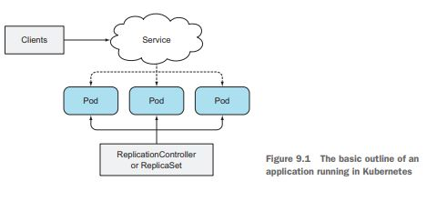

- 기존 파드를 모두 삭제한 다음 새 파드들을 한꺼번에 시작하기
- 새 파드를 하나 시작한 후 기존 파드를 제거하고, 이 행동을 반복하기

---

### 9.1.1 오래된 파드를 삭제하고 새 파드로 교체

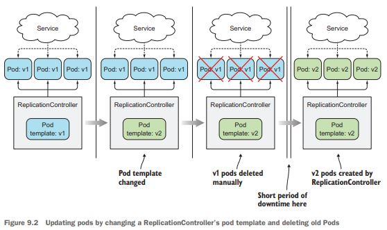

- 이전 파드가 삭제되고 새 파드가 시작되는 동안 짧은 시간의 다운타임이 허용된다면 파드 세트를 간단하게 업데이트 할 수 있다.

---

### 9.1.2 새 파드 기동과 이전 파드 삭제

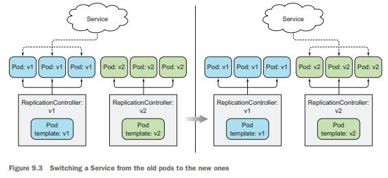

- 블루-그린 디플로이먼트
- 잠시 동안 두 배의 파드가 실행되므로 더 많은 하드웨어 리소스가 필요하다.
- 새 버전이 올바르게 작동하면 이전 레플리케이션 컨트롤러(블루)를 삭제한다.

---

### 9.1.2 새 파드 기동과 이전 파드 삭제

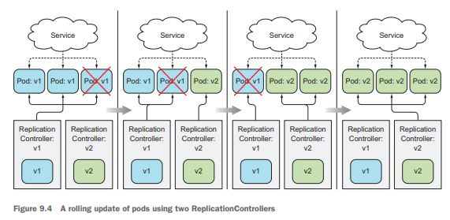

- 파드를 단계별로 업데이트하는 롤링 업데이트 방법도 있다

---

## 9.2 레플리케이션컨트롤러로 자동 롤링 업데이트 수행

---

### 9.2.1 애플리케이션의 초기 버전 실행

```javascript
const http = require("http");
const os = require("os");

console.log("Kubia server starting...");

var handler = function (request, response) {
  console.log("Received request from " + request.connection.remoteAddress);
  response.writeHead(200);
  response.end("This is v4 running in pod " + os.hostname() + "\n");
};

var www = http.createServer(handler);
www.listen(8080);
```

---

### 9.2.1 애플리케이션의 초기 버전 실행

```yml
metadata:
  name: kubia
  labels:
    app: kubia
spec:
  containers:
    - image: luksa/kubia:v1
      name: nodejs
--- # 대시 세 개가 있는 줄로 구분해 여러 리소스 정의를 포함한다
apiVersion: v1
kind: Service
metadata:
  name: kubia
spec:
  type: LoadBalancer
  selector:
    app: kubia
  ports:
    - port: 80
      targetPort: 8080
```

---

### 9.2.1 애플리케이션의 초기 버전 실행

```powershell
$ kubectl create -f kubia-rc-and-service-v1.yaml
```

---

### 9.2.1 애플리케이션의 초기 버전 실행

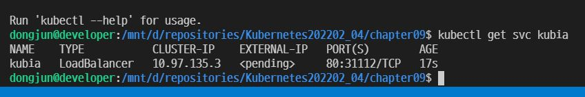

- minikube에서 서비스 테스트 하기
  미니쿠베를 로컬환경에 설치하고 쿠버네티스 서비스를 로드 밸런서 타입으로 배포하면, External IP할당이 되지 않는다. 그래서 아래 그림과 같이 External-IP가 계속 <pending>으로 보이게 된다.
  (출처: https://bcho.tistory.com/1308 [조대협의 블로그])

---

### 9.2.1 애플리케이션의 초기 버전 실행

```powershell
$ minikube tunnel >/dev/null 2>&1 &
```

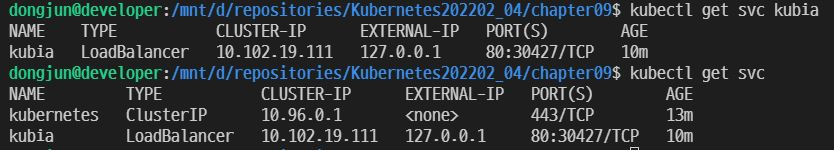

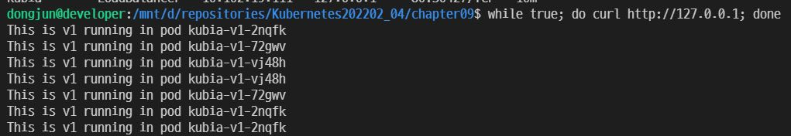

---

### 9.2.2 kubectl을 이용한 롤링 업데이트

```javascript
var handler = function (request, response) {
  console.log("Received request from " + request.connection.remoteAddress);
  response.writeHead(200);
  response.end("This is v2 running in pod " + os.hostname() + "\n");
};
```

```powershell
$ kubectl rolling-update kubia-v1 kubia-v2 --image=luksa/kubia:v2
$ kubectl describe rc kubia-v2
```

- 이제는 동작하지 않는 명령어

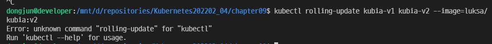

---

### 9.2.3 kubectl rolling-update를 더 이상 사용하지 않는 이유

- 저자 스스로 만든 오브젝트를 쿠버네티스가 수정하는 것을 좋아하지 않는다.
  - kubectl rolling-update 안에는 kubectl이 레플리케이션 컨트롤러의 셀렉터와 실행중인 파드의 레이블을 수정하는 내용이 있다.
- 클라이언트 단에서(kubectl) 실제 명령으로(imperative) 실행하였기 때문에 쿠버네티스의 선언적(declarative) 철학과 어긋난다.
- 쿠버네티스에서 애플리케이션을 배포하는 가장 좋은 방법인 **디플로이먼트**라는 새로운 리소스를 도입하였다.

---

## 9.3 애플리케이션을 선언적으로 업데이트하기 위한 디플로이먼트 사용하기

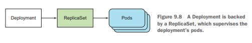

- 낮은 수준의 구조 대신(레플리케이션 컨트롤러) 디플로이먼트를 사용하면 하나의 디플로이먼트 리소스를 통해 레플리카셋을 활용하여 파드를 생성하고 관리할 수 있다.

---

## 9.3 애플리케이션을 선언적으로 업데이트하기 위한 디플로이먼트 사용하기

---

### 9.3.1 디플로이먼트 생성

```yml
apiVersion: apps/v1
kind: Deployment ## 디플로이먼트 버전을 포함할 필요가 없다.
metadata:
  name: kubia
spec:
  replicas: 3
  template:
    metadata:
      name: kubia
      labels:
        app: kubia
    spec:
      containers:
        - image: luksa/kubia:v1
          name: nodejs
  selector:
    matchLabels:
      app: kubia
```

---

### 9.3.1 디플로이먼트 생성

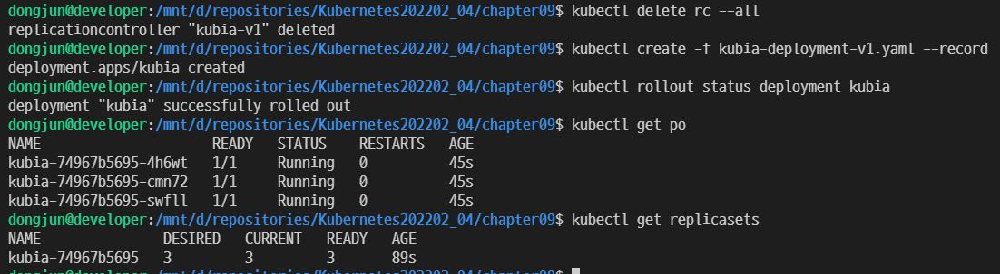

---

### 9.3.2 디플로이먼트 업데이트

- RollingUpdate
  : 하나씩 바꾸어 생성
- Recreate
  : 한번에 모든 파드를 삭제 후 재생성

```powershell
$ kubectl patch deployment kubia -p '{"spec": {"minReadySeconds":10}}'
$ kubectl set image deployment kubia nodejs=luksa/kubia:v2
$ while true; do curl 서비스IP; done
```

---

### 9.3.2 디플로이먼트 업데이트

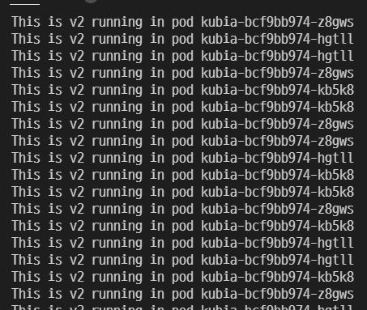

---

### 9.3.2 디플로이먼트 업데이트

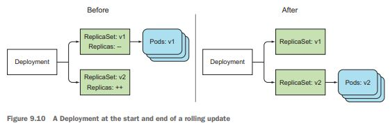

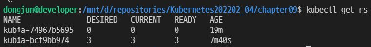

---

### 9.3.3 디플로이먼트 롤백

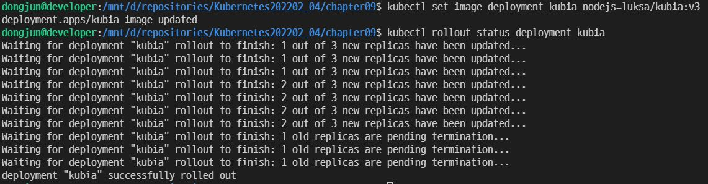

---

### 9.3.3 디플로이먼트 롤백

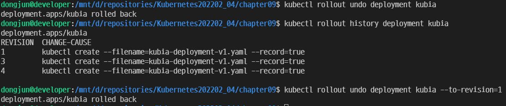

---

### 9.3.4 롤아웃 속도 제어

- 롤링 업데이트 전략의 maxSurge와 maxUnavailable 속성 소개
- maxSurge : 디플로이먼트가 의도하는 레플리카 수보다 얼마나 많은 파드 인스턴스 수를 허용할 수 있는지를 결정한다. 기본적으로는 25%로 설정되고, 의도한 개수보다 최대 25% 더 많은 파드 인스턴스가 있을 수 있다. 백분율을 파드의 수로 환산했을 때 **숫자는 반올림한다**.

- maxUnavailable : 사용할 수 없는 파드 인스턴스 수를 결정한다. 기본적으로 25%로 설정되고, 사용 가능한 파드 인스턴스 수는 의도하는 레플리카 수의 75% 이하로 떨어지지 않아야 한다. 백분율을 파드의 수로 환산했을 때 **숫자는 내림한다**.

---

### 9.3.4 롤아웃 속도 제어

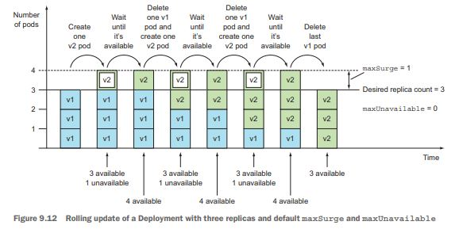

---

### 9.3.4 롤아웃 속도 제어

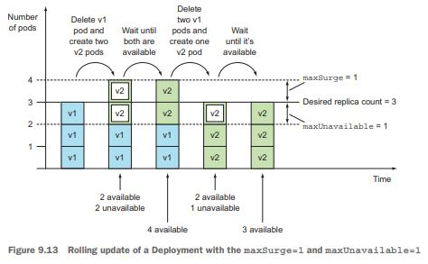

---

### 9.3.5 롤아웃 프로세스 일시 중지

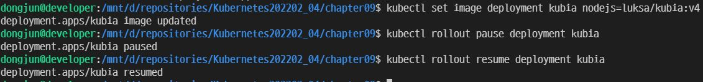

---

### 9.3.5 롤아웃 프로세스 일시 중지

- 카나리 릴리스canary release : 잘못된 버전의 애플리케이션이 롤아웃되어서 모든 사용자에게 영향을 주는 위험을 최소화하는 기술

---

### 9.3.5 롤아웃 프로세스 일시 중지


---

### 9.3.6 잘못된 버전의 롤아웃 방지

- 모든 파드의 **레디니스 프로브**가 성공하면 파드가 준비된다.
- minReadySeconds가 지나기 전에 새 파드가 제대로 작동되지 않고 레디니스 프로브가 실패하기 시작하면 새 버전의 롤아웃이 효과적으로 차단된다.

---

## 5.5 파드가 연결을 수락할 준비가 됐을 때 신호 보내기

- 파드는 구성에 시간이 걸리거나, 데이터를 로드하는 데 시간이 필요할 수도 있다. 그러므로, 완전히 준비될 때까지 기동 중인 파드에는 요청을 전달하지 않는 것이 좋다.

---

### 5.5.1 레디니스 프로브 소개

- 레디니스 프로브readiness probe는 주기적으로 호출되며 특정 파드가 클라이언트 요청을 수신할 수 있는지를 확인한다.
- 레디니스 프로브의 유형
  - Exec 프로브 : 컨테이너의 상태를 프로세스의 종료 상태 코드로 결정한다.
  - Http Get 프로브 : get request를 컨테이너에 보내고 http response 상태코드를 보고 컨테이너의 상태를 점검해본다
  - TCP 소켓 프로브 : TCP 소켓이 연결connect되면 컨테이너가 준비된 것으로 생각한다.
- **라이브니스 프로브와 달리 컨테이너가 준비 상태에 실패하더라도 컨테이너가 종료되거나 다시 시작되지 않고, 다른 컨테이너로 트래픽을 보내도록 유도한다**

---

### 5.5.1 레디니스 프로브 소개

- 레디니스 프로브에 실패한 파드는 서비스의 엔드포인트에서 제거된다.
  - 파드 자체가 없어지는 것은 아니다.
- 클라이언트는 항상 정상상태인 파드와 통신하므로 시스템에 문제가 있다는 것을 알아차리지 못한다.

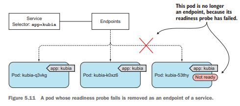

---

### 9.3.6 잘못된 버전의 롤아웃 방지

```yml
spec: # 상략
  replicas: 3
  minReadySeconds: 10 # 10초로 설정
  strategy:
    rollingUpdate:
      maxSurge: 1 # 앞의 수식에 의해 최대 4, 최소 3이 적용된다
      maxUnavailable: 0
    type: RollingUpdate
  template: # 중략
    spec:
      containers:
        - image: luksa/kubia:v3
          name: nodejs
          readinessProbe: # 매초마다 실행될 readinessProbe
            periodSeconds: 1
            httpGet:
              path: /
              port: 8080
```

---

### 9.3.6 잘못된 버전의 롤아웃 방지

- 하나의 파드가 새로 생성됐다고 표시돼 있으므로 V3가 나와야 하는데 그렇지 않다.
- 파드를 조회해보면 준비되지 않은 것을 알 수 있다.
- 비정상 파드로는 전달되지 않는다.

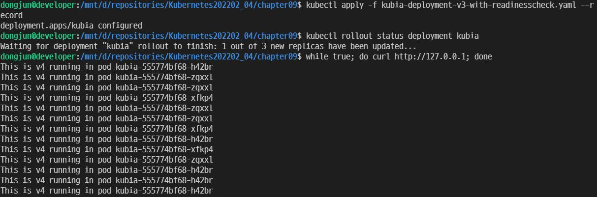

---

### 9.3.6 잘못된 버전의 롤아웃 방지

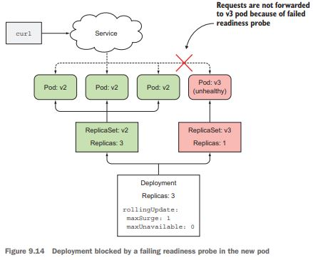

---

### 9.3.6 잘못된 버전의 롤아웃 방지

- 기본적으로 10분 동안 롤아웃이 진행되지 않으면 실패한 것으로 간주한다.
- 방금의 경우는 실패를 시키도록 한다.

---

## 9.4 요약

- 디플로이먼트를 활용해서 업데이트하기
- 중간에 디플로이먼트 중간 및 재개하기
- maxSurge, maxUnavailable 활용하기
