<style>
.section{
font-family: 'D2Coding', serif !important;
}
</style>


# 14장. 파드의 컴퓨팅 리소스 관리

---

## 14.1 파드 컨테이너의 리소스 요청

- 파드를 생성할 때 컨테이너가 필요로 하는 cpu와 메모리 양과 사용할 수 있는 엄격한 제한을 지정할 수 있다.

---

### 14.1.1 리소스 요청을 갖는 파드 생성하기

- 이런 파드/컨테이너 다섯 개를 CPU 코어 하나에서 충분히 빠르게 실행할 수 있다.

```yml
apiVersion: v1
kind: Pod
metadata:
  name: requests-pod
spec:
  containers:
    - image: busybox
      command: ["dd", "if=/dev/zero", "of=/dev/null"]
      name: main
      resources:
        requests:
          cpu: 200m # 컨테이너는 200밀리코어를 요청한다(하나의 CPU 시간의 1/5)
          memory: 10Mi # 컨테이너는 10Mi의 메모리를 요청한다.
```

---

- 파드를 실행하면 컨테이너 안에서 top을 실행해 프로세스의 CPU 소비량을 확인할 수 있다.
- Minikube 가상머신은 CPU 코어 2개가 할당되어 있다. 프로세스가 전체 CPU의 50% 를 소비하는 것으로 표시되는 이유다.
  (minikube를 설정할 때 메모리나 CPU를 4개로 조금 더 줘서 그런지 여기서는 비율이 다르게 나온다)

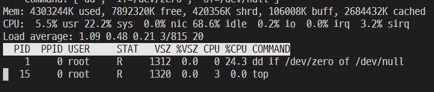

---

### 14.1.2 리소스 요청이 스케줄링에 미치는 영향

#### 파드가 특정 노드에 실행될 수 있는지 스케줄러가 결정하는 방법

- 스케줄러는 스케줄링하는 시점에 각 개별 리소스가 얼마나 사용되는지 보지 않고, 노드에 배포된 파드들의 리소스 요청량의 전체 합만을 본다.

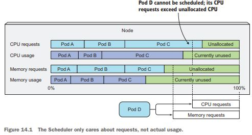


---

#### 스케줄러가 파드를 위해 최적의 노드를 선택할 때 파드의 요청을 사용하는 방법

- LeastRequestedPriority : 요청된 리소스가 낮은 노드
- MostRequestedPriority : 리소스가 가장 많은 노드, 가장 적은 수의 노드를 사용하도록 보장
  - 파드를 일부 노드에 많이 스케줄링해서 특정 노드를 비울수 있고 제거할 수 있다
  - 노드 별로 비용을 지불하므로 비용을 절감할 수 있다.

---

#### 노드의 용량 검사

- 노드 추가 생성

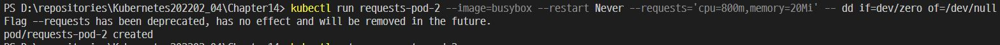

- 정상 동작을 확인

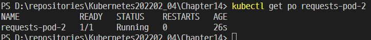

---

#### 어느 노드에도 실행할 수 없는 파드 생성

- 노드 추가 생성

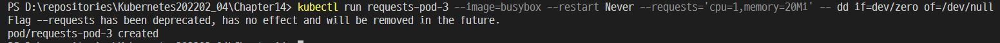

- 원래는 CPU가 모자라야 한다.

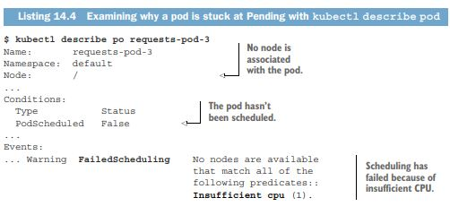

---

#### 파드가 스케줄링되지 않은 이유

- 원래는 세 번째 파드가 1,000 밀리코어를 요청했고, 이 요청이 노드를 오버커밋overcommit하게 만들기 때문에 스케줄러는 노드에 파드를 스케줄링할 수 없다.

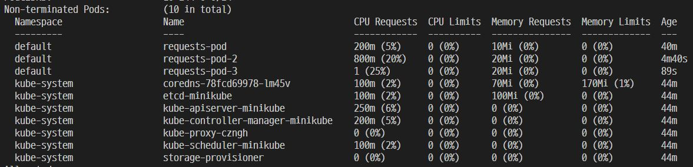

---

### 14.1.3 CPU 요청이 CPU 시간 공유에 미치는 영향

- cpu 요청은 단지 스케줄링에만 영향을 미칠 뿐만 아니라 남은 CPU 시간을 파드 간에 분배하는 방식도 결정한다. 첫 번째 파드가 CPU의 200 밀리코어를 요청하고
  다른 파드가 1,000 밀리코어를 요청하므로 미사용된 CPU는 두 파드 사이에 1:5의 비율로 나뉜다.


- 그러나 한 컨테이너가 CPU를 최대로 사용하려는 순간 나머지 파드가 유휴 상태에 있다면 첫 번째 컨테이너가 전체 CPU 시간을 사용할 수 있다.

---

### 14.1.4 사용자 정의 리소스의 정의와 요청

- 쿠버네티스를 사용하면 사용자 정의 리소스를 노드에 추가하고 파드의 리소스 요청으로 사용자 정의 리소스를 요청할 수 있다.
- 사용자 정의 리소스이 사례로는 노드에 사용 가능한 GPU 단위 수가 있다.

---

## 14.2 컨테이너에 사용 가능한 리소스 제한

### 14.2.1 컨테이너가 사용 가능한 리소스 양을 엄격한 제한으로 설정

- 메모리는 분명 다르다. 압축이 불가능하다. 프로세스에 메모리가 주어지면 프로세스가 메모리를 해제하지 않는 한 가져갈 수 없다. 그것이 컨테이너에 할당되는 메모리의 최대량을 제한해야 하는 이유다.
  메모리를 제한하지 않으면 워커 노드에 실행 중인 컨테이너는 사용 가능한 모든 메모리를 사용해서 노드에 있는 다른 모든 파드와 노드에 스케줄링되는 새 파드에 영향을 미칠 수 있다.

---

#### 리소스 제한을 갖는 파드 생성

```yml
apiVersion: v1
kind: Pod
metadata:
  name: limited-pod
spec:
  containers:
    - image: busybox
      command: ["dd", "if=/dev/zero", "of=/dev/null"]
      name: main
      resources:
        limits:
          # CPU 1코어와 memory 20Mi 이상을 사용할 수 없다.
          cpu: 1
          memory: 20Mi
```

---

#### 리소스 제한 오버커밋

- 노드에 있는 모든 파드의 리소스 제한 합계는 노드 용량의 100%를 초과할 수 있다. 다시 말하면 리소스 제한은 오버커밋 될 수 있다.

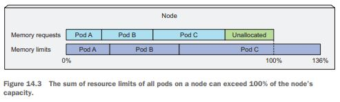

---

### 14.2.2 리소스 제한 초과

- 메모리 제한 초과와 종료가 지속되면 쿠버네티스는 재시작 사이의 지연 기간을 증가시키면서 재시작시킨다. 이런 경우 CrashLoopBackOff 상태가 표시된다.

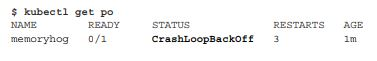

- 첫 번째 크래시 후에 Kubelet은 컨테이너를 즉시 다시 재시작하고 다시 크래시가 발생하면 다시 시작하기 전에 10초를 기다린다. 이후 크래시가 발생하면 지연 시간이 20초, 30초, 80초, 160초로 지수로 증가하고 마지막으로 300초로 제한된다. 간격이 300초 제한에 도달하면 5분마다 컨테이너를 계속 재시작한다.

---

### 14.2.3 컨테이너의 애플리케이션이 제한을 바라보는 방법

#### 컨테이너는 항상 컨테이너 메모리가 아닌 노드 메모리를 본다

top 명령은 컨테이너가 실행 중인 전체 노드의 메모리 양을 표시한다. 컨테이너에 사용 가능한 메모리의 제한을 설정하더라도 컨테이너는 이 제한을 인식하지 못한다.

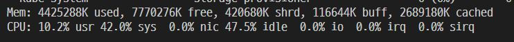

---

## 14.3 파드 QoS 클래스 이해

쿠버네티스는 파드를 세 가지 품질(Quality of Service, QoS) 클래스로 분류한다.

- BestEffort
- Burstable
- Guaranteed

---

### 14.3.1 파드의 QoS 클래스 정의

#### BestEffort 클래스에 파드를 할당하기

우선순위가 가장 낮은 클래스는 BestEffort 클래스다. 아무런 리소스 요청과 제한이 없는 파드에 할당된다. 이런 파드에 실행중인 컨테이너는 리소스 보장을 받지 못한다. CPU 시간을 전혀 받지 못할 수도 있고, 다른 파드를 위해 메모리가 해제돼야 할 때 가장 먼저 종료된다. 그러나 메모리가 충분하다면 컨테이너는 원하는 만큼 메모리를 사용할 수 있다.

---

#### Guaranteed 클래스에 파드를 할당하기

파드의 클래스가 Guaranteed이려면 다음 세 가지를 충족하여야 한다

- CPU와 메모리에 리소스 요청과 제한이 모두 설정돼야 한다.
- 각 컨테이너에 설정돼야 한다
- 리소스 요청과 제한이 동일해야 한다.

---

#### Guaranteed 클래스에 파드를 할당하기

Burstable 파드는 요청한 양 만큼의 리소스를 얻지만 필요하면 추가 리소스를 사용할 수 있다.

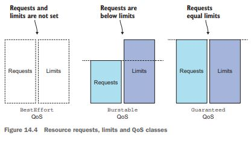

---

#### 컨테이너 QoS 클래스 파악

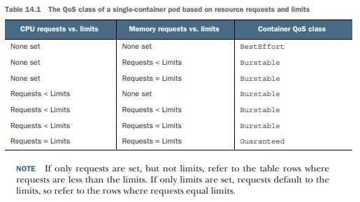

---

### 14.3.2 메모리가 부족할 때 어떤 프로세스가 종료되는지 이해

BestEffort 클래스가 가장 먼저 종료되고 다음은 Burstable 파드가 종료되며, 마지막으로 Guaranteed 파드는 시스템 프로세스가 메모리를 필요로 가는 경우에만 종료된다.

---

### 14.3.2 메모리가 부족할 때 어떤 프로세스가 종료되는지 이해

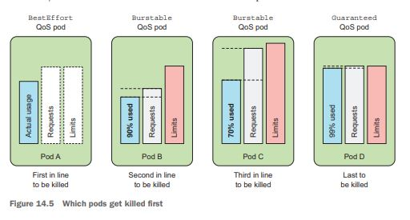

컨테이너가 하나인 파드 두 개가 존재하고 둘 다 Burstable class 일 때 시스템은 요청된 메모리의 비율이 다른 것보다 높은 컨테이너를 종료한다. C가 B보다 더 많은 메모리를 사용하지만 메모리 요청에 관한 사용량의 비율은 낮다.

---

## 14.4 네임스페이스별 파드에 대한 기본 요청과 제한 설정

### 14.4.1 LimitRange 리소스 소개

LimitRange 리소스는 컨테이너의 각 리소스에 최소/최대 제한을 지정할 뿐만 아니라 리소스 요청을 명시적으로 지정하지 않은 컨테이너의 기본 리소스 요청을 지정한다.

---

### 14.4.1 LimitRange 리소스 소개

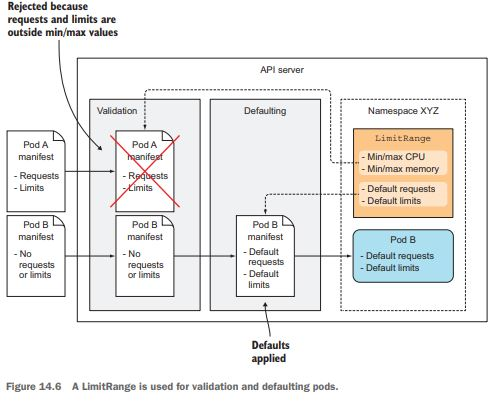

---

### 14.4.2 LimitRange 오브젝트 생성하기

```yml
spec:
  limits:
    - type: Pod # 파드 전체에 리소스 제한 지정
      min: # 컨테이너의 최소 리소스 제한
        cpu: 50m
        memory: 5Mi
      max:
        cpu: 1
        memory: 1Gi
    - type: Container # 컨테이너 전체에 리소스 제한 지정
      defaultRequest:
        cpu: 100m
        memory: 10Mi
      default: # 기본 제한
        cpu: 200m
        memory: 100Mi
    - type: PersistentVolumeClaim
      min:
        storage: 1Gi
      max:
        storage: 10Gi
```

---

### 14.4.3 강제 리소스 제한

제한이 설정되면 이제 LimitRange에서 허용하는 것보다 더 많은 CPU를 요청하는 파드를 만들 수 ~~있~~**없**다.

With your limits in place, you can now try creating a pod that requests more CPU than allowed by the LimitRange.

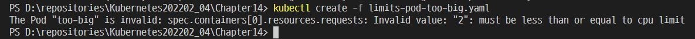

---

### 14.4.4 기본 리소스 요청과 제한 적용

리소스 요청과 제한을 지정하지 않은 컨테이너는 생성 시 LimitRange 오브젝트에서 지정한 것과 일치한다.

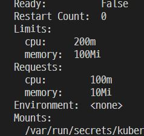

---

## 14.5 네임스페이스의 사용 가능한 총 리소스 제한하기

### 14.5.1 리소스쿼터 오브젝트 소개

리소스 쿼터는 네임스페이스에서 파드가 사용할 수 있는 컴퓨팅 리소스 양과 퍼시스턴트볼륨클레임이 사용할 수 있는 스토리지 양을 제한한다. 또한 네임스페이스 안에서 사용자가 만들 수 있는 파드, 클레임, 기타 API 오브젝트의 수를 제한할 수 있다.

---

#### CPU 및 메모리에 관한 리소스 쿼터 생성

```yml
apiVersion: v1
kind: ResourceQuota
metadata:
  name: cpu-and-mem
spec:
  hard:
    # 전체의 최댓값을 제한하는 구조
    requests.cpu: 400m
    requests.memory: 200Mi
    limits.cpu: 600m
    limits.memory: 500Mi
```

리소스쿼터를 생성할 때 주의할 점은 LimitRange 오브젝트도 함께 생성해야 한다는 것이다.

---

### 14.5.3 생성 가능한 오브젝트 수 제한

리소스쿼터는 네임스페이스 내의 파드, 레플리케이션컨트롤러, 서비스, 레플리카셋, 디플로이먼트 및 그 외의 오브젝트 수를 제한하도록 구성할 수 있다.

```yml
apiVersion: v1
kind: ResourceQuota
metadata:
  name: objects
spec:
  hard:
    pods: 10
    replicationcontrollers: 5
    secrets: 10
    configmaps: 10
    persistentvolumeclaims: 5
    services: 5
    services.loadbalancers: 1
    services.nodeports: 2
    ssd.storageclass.storage.k8s.io/persistentvolumeclaims: 2
```

---

### 14.5.4 특정 파드 상태나 QoS 클래스에 대한 쿼터 지정

쿼터 역시 쿼터 범위로 제한될 수도 있다. 현재 BestEffort, NotBestEffort, Terminating, NotTerminating

아래 사례는 유효 데드라인이 없는 BestEffort QoS를 갖는 파드가 최대 4개 존재하도록 보장한다.

```yml
apiVersion: v1
kind: ResourceQuota
metadata:
  name: besteffort-notterminating-pods
spec:
  scopes:
    - BestEffort
    - NotTerminating
  hard:
    pods: 4
```

---

## 14.6 파드 리소스 사용량 모니터링
 
 Kubelet 자체에는 이미 cAdvisor라는 에이전트가 포함돼 있는데 이 에이전트는 노드에서 실행되는 개별 컨테이너와 노드 전체의 리소스 사용 데이터를 수집한다. 전체 클러스터를 대상으로 이러한 통계를 중앙에서 수집하려면 힙스터를 사용해야 한다.(최근 쿠버네티스에서는 힙스터 대신 메트릭 서버를 사용하는 추세이다.)

---

#### heapster를 사용한다면 할당량이 아닌 실제 데이터를 볼 수 있다.

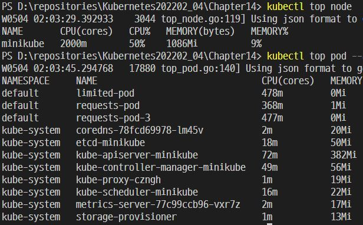

---

### 14.6.1 실제 리소스 사용량 수집과 검색

통계 데이터 저장을 위해 InfluxDB를, 시각화와 분석을 위해 Grafana를 사용한다.

인플럭스DB는 애플리케이션 메트릭과 기타 모니터링 데이터를 저장하는 데 이상적인 오픈소스 시계열 데이터베이스이다. 오픈소스인 그라파나는 인플럭스DB에 저장된 데이터를 시각화하고 시간이 지남에 따라 애플리케이션의 리소스 사용량이 어떻게 변하는지 확인할 수 있는 멋진 웹 콘솔을 갖춘 분석 및 시각화 제품이다.

---

### 14.6.2 기간별 리소스 사용량 통계 저장 및 분석

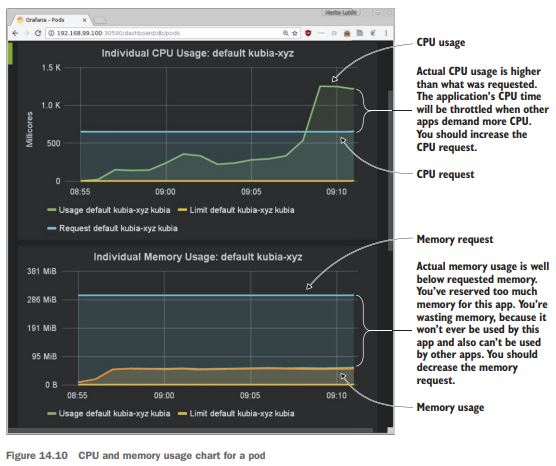

---

## 14.7 요약

- 컨테이너는 CPU를 너무 많이 사용하는 경우 절대 종료되지 않지만, 메모리를 너무 많이 사용하려고 하면 종료된다
- LimitRange 오브젝트를 이용해 개별 파드에 관한 제한을 정의할 수 있고, ResourceQuota 오브젝트를 이용해 모든 파드에서 사용할 수 있는 제한을 정의할 수 있다.
