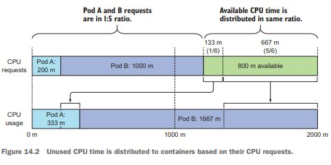

# 14장. 파드의 컴퓨팅 리소스 관리

## 14.1 파드 컨테이너의 리소스 요청

- 파드를 생성할 때 컨테이너가 필요로 하는 cpu와 메모리 양과 사용할 수 있는 엄격한 제한을 지정할 수 있다.

### 14.1.1 리소스 요청을 갖는 파드 생성하기

- 이런 파드/컨테이너 다섯 개를 CPU 코어 하나에서 충분히 빠르게 실행할 수 있다.

```yml
apiVersion: v1
kind: Pod
metadata:
  name: requests-pod
spec:
  containers:
  - image: busybox
    command: ["dd", "if=/dev/zero", "of=/dev/null"]
    name: main
    resources:
      requests:
        cpu: 200m   # 컨테이너는 200밀리코어를 요청한다(하나의 CPU 시간의 1/5)
        memory: 10Mi # 컨테이너는 10Mi의 메모리를 요청한다.
```

- 파드를 실행하면 컨테이너 안에서 top을 실행해 프로세스의 CPU 소비량을 확인할 수 있다. 
- Minikube 가상머신은 CPU 코어 2개가 할당되어 있다. 프로세스가 전체 CPU의 50% 를 소비하는 것으로 표시되는 이유다.

### 14.1.2 리소스 요청이 스케줄링에 미치는 영향

#### 파드가 특정 노드에 실행될 수 있는지 스케줄러가 결정하는 방법

- 스케줄러는 스케줄링하는 시점에 각 개별 리소스가 얼마나 사용되는지 보지 않고, 노드에 배포된 파드들의 리소스 요청량의 전체 합만을 본다.


#### 스케줄러가 파드를 위해 최적의 노드를 선택할 때 파드의 요청을 사용하는 방법
 
- LeastRequestedPriority : 요청된 리소스가 낮은 노드
- MostRequestedPriority : 리소스가 가장 많은 노드, 가장 적은 수의 노들르 사용하도록 보장

#### 노드의 용량 검사

#### 파드가 스케줄링되지 않은 이유



### 14.1.3 CPU 요청이 CPU 시간 공유에 미치는 영향

### 14.1.4 사용자 정의 리소스의 정의와 요청

## 14.2 컨테이너에 사용 가능한 리소스 제한

### 14.2.1 컨테이너가 사용 가능한 리소스 양을 엄격한 제한으로 설정

#### 리소스 제한을 갖는 파드 생성

```yml
apiVersion: v1
kind: Pod
metadata:
  name: limited-pod
spec:
  containers:
  - image: busybox
    command: ["dd", "if=/dev/zero", "of=/dev/null"]
    name: main
    resources:
      limits:
        cpu: 1
        memory: 20Mi
```

### 14.2.2 리소스 제한 초과

### 14.2.3 컨테이너의 애플리케이션이 제한을 바라보는 방법

## 14.3 파드 QoS 클래스 이해

### 14.3.1 파드의 QoS 클래스 정의

### 14.3.2 메모리가 부족할 때 어떤 프로세스가 종료되는지 이해

## 14.4 네임스페이스별 파드에 대한 기본 요청과 제한 설정

### 14.4.1 LimitRange 리소스 소개

### 14.4.2 LimitRange 오브젝트 생성하기

### 14.4.3 강제 리소스 제한

### 14.4.4 기본 리소스 요청과 제한 적용

## 14.5 네임스페이스의 사용 가능한 총 리소스 제한하기

### 14.5.1 리소스쿼터 오브젝트 소개

### 14.5.2 퍼시스턴트 스토리지에 관한 쿼터 지정하기

### 14.5.3 생성 가능한 오브젝트 수 제한

### 14.5.4 특정 파드 상태나 QoS 클래스에 대한 쿼터 지정

## 14.6 파드 리소스 사용량 모니터링

### 14.6.1 실제 리소스 사용량 수집과 검색

### 14.6.2 기간별 리소스 사용량 통계 저장 및 분석

## 14.7 요약
